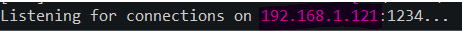
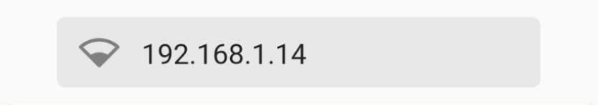
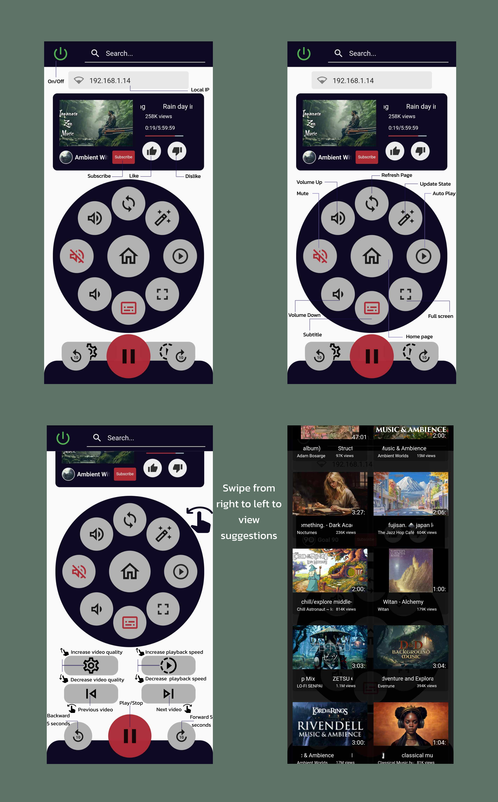

# YouTube Controller  [](https://wakatime.com/badge/user/7f5deea0-098f-47a7-b024-26be3ca6e2e1/project/52f20a20-3219-4da0-8748-7a9f31780e19)
YouTube controller is a cross-platform mobile remote controller that controls the YouTube website and video player over LAN.


>**Warning**
This is the Alpha version of the project, errors may occur .

# Setup
- ## PC Installation:
  Install ```YouTube_Controller.exe``` on your PC and open the app.
  >**Warning**
  Please make sure that Chrome is opened before starting the application.

  Wait until it finishes the setup and then you will see your local IP like this:
    
- ## Mobile Installation:
  Install ```YouTube_Controller.apk``` on your smartphone and open the app.
  >**Warning**
  The app is only avalabile on Android now due to IOS restrictions.

  Enter the ip address in the specified field :

  

  press done, And you are all set!

- ## Usage:


# Contribution
  Any contibution on this project would be appreciated, if you face any issue you can open an issue and we will handle it ASAP.
  For more information do not hesitate to contact me (mkassab215@outlook.com).


# Development
  Development on this project has been done on :
  - Windows 10
  - Python - 3.9
  - Selenium - 4.1
  - Excutable Chrome - v105
  
## Requirments

- ### Requirements.txt
  Requirements.txt contains all the packages needed to make this project work.
  ```
  pip install -r requirements.txt
  ```
- ### Dependencies
  Development on this project has been done on :
  - Windows 10
  - Python - 3.9
  - Selenium - 4.1
  - Excutable Chrome - v105
  

# Issues
- ## Vulnerability & Bugs
  Few functions are buggy and can cause errors.

- ## User-Experience
  Mobile app isn't Design-Responsive, it will be in the next update.
